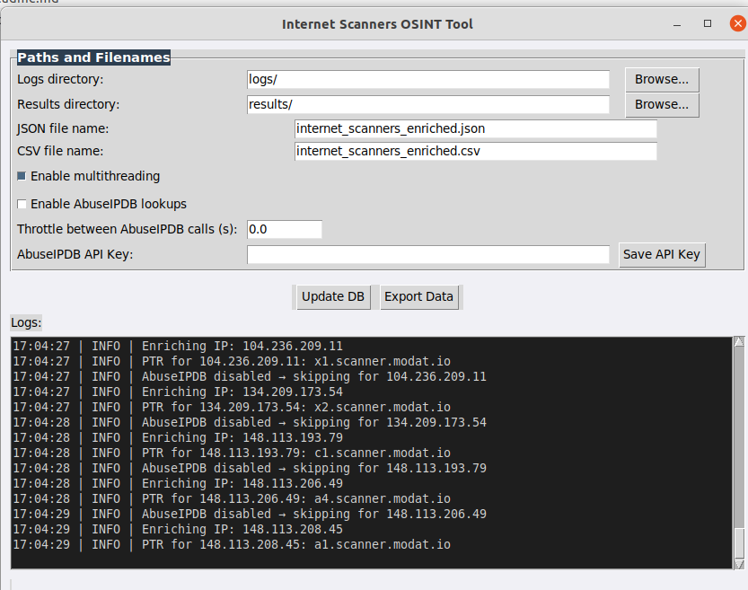
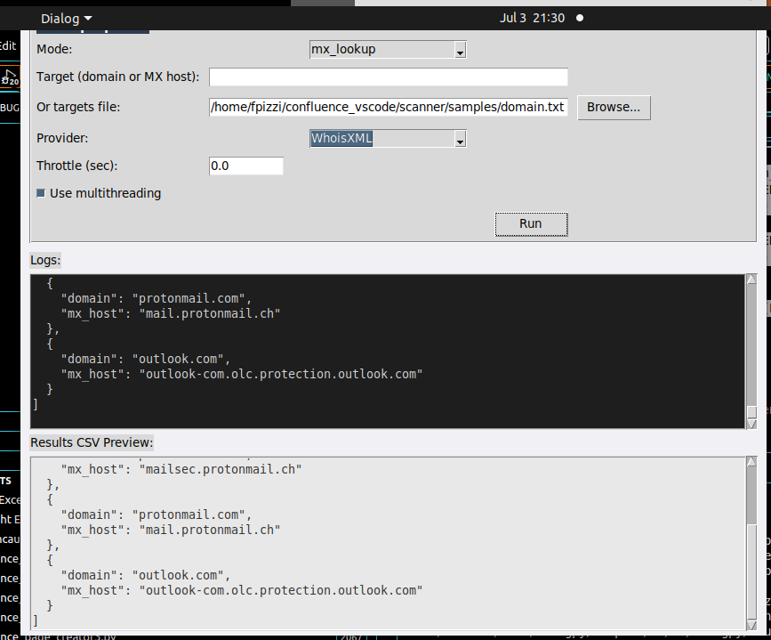

# Internet Scanners & Reverse MX — OSINT Toolkit

[](https://github.com/mo0ogly/Internet-Scanners-OSINT-Tool/actions/workflows/ci.yml)
[](LICENSE)
[]()
[](https://github.com/astral-sh/ruff)
[]()

A Python-based OSINT toolkit for cybersecurity analysts, threat hunters, and network defenders.

**Two tools, three interfaces:**

| Tool | What it does |
|------|-------------|
| **Internet Scanners Extractor** | Extracts IPs from known scanner lists, enriches them with PTR, ASN, and AbuseIPDB data |
| **Reverse MX Lookup** | Discovers email infrastructure and enumerates domains sharing the same mail server |

Each tool is available as **CLI**, **Tkinter GUI**, and **Docker container** (with interactive menu).

> **Author**: [Fabrice Pizzi](https://github.com/mo0ogly) — Cyber Defense & AI Security Expert

---

## Quick Start

### Option 1: Docker (recommended)

No Python install required. Build once, run anywhere.

```bash
git clone https://github.com/mo0ogly/Internet-Scanners-OSINT-Tool.git
cd Internet-Scanners-OSINT-Tool
docker build -t internet-scanners-osint .
```

**Interactive menu** — the easiest way to get started:

```bash
docker run --rm -it -v "$(pwd)/results:/app/results" internet-scanners-osint menu
```

This opens a guided menu where you choose what to do:

```
============================================
  Internet Scanners OSINT Tool
============================================

  1) Internet Scanner — from Git repo (default: MDMCK10/internet-scanners)
  2) Internet Scanner — from local IP file
  3) Reverse MX Lookup — MX lookup for a domain
  4) Reverse MX Lookup — Reverse MX (find domains on a mail server)
  5) Quit

  Choose [1-5]:
```

Each option guides you step by step (repo URL, AbuseIPDB, throttle, etc.) before launching.

### Option 2: Python (native)

```bash
git clone https://github.com/mo0ogly/Internet-Scanners-OSINT-Tool.git
cd Internet-Scanners-OSINT-Tool
pip install -r requirements.txt
```

---

## Docker Usage

### Interactive menu

```bash
docker run --rm -it -v "$(pwd)/results:/app/results" internet-scanners-osint menu
```

### Direct commands

For scripting or CI pipelines, use direct commands instead of the menu:

```bash
# Show all available commands
docker run --rm internet-scanners-osint

# Show scanner options
docker run --rm internet-scanners-osint scanner
```

#### Internet Scanner — from Git repo

Clones a repo containing scanner IP lists (default: [MDMCK10/internet-scanners](https://github.com/MDMCK10/internet-scanners)), extracts all IPs, and enriches each one.

```bash
# Basic scan (default repo)
docker run --rm -v "$(pwd)/results:/app/results" \
    internet-scanners-osint scanner --run

# Custom repo
docker run --rm -v "$(pwd)/results:/app/results" \
    internet-scanners-osint scanner --run \
    --repo-url https://github.com/user/other-scanner-list.git

# With AbuseIPDB enrichment
docker run --rm -v "$(pwd)/results:/app/results" \
    internet-scanners-osint scanner --run \
    --enable-abuseipdb --abuseipdb-api-key YOUR_KEY --throttle 1.0
```

#### Internet Scanner — from local IP file

Scan your own list of IPs instead of cloning a repo. Create a text file with one IP per line:

```
# my_ips.txt
8.8.8.8
1.1.1.1
45.33.84.152
2606:4700::6810:85e5
```

```bash
docker run --rm \
    -v "$(pwd)/results:/app/results" \
    -v "$(pwd)/my_ips.txt:/app/input.txt" \
    internet-scanners-osint scanner --run --input-file /app/input.txt
```

#### MX Lookup

Find which mail servers handle a domain's email:

```bash
docker run --rm internet-scanners-osint \
    reverse-mx --mode mx_lookup --target google.com
```

#### Reverse MX Lookup

Discover all domains hosted on the same mail server:

```bash
docker run --rm internet-scanners-osint \
    reverse-mx --mode reverse_mx \
    --target aspmx.l.google.com \
    --provider ViewDNS
```

#### Interactive shell

```bash
docker run --rm -it internet-scanners-osint shell
```

---

## Tool 1: Internet Scanners Extractor

### How it works

1. **Input**: clones a Git repo containing scanner IP lists, or reads a local IP file
2. **Extraction**: parses `.txt`, `.conf`, `.nft` files to find IPv4/IPv6 addresses
3. **Enrichment** (for each IP):
   - Reverse DNS (PTR) lookup
   - ASN and network info via IPWhois (RDAP)
   - AbuseIPDB reputation score (optional, requires API key)
4. **Output**: timestamped JSON and CSV files in `results/`

```
Input source                   Enrichment pipeline               Output
─────────────                  ────────────────────              ──────
Git repo (remote)    ──┐
                       ├──►  Extract IPs  ──►  PTR   ──┐
Local IP file        ──┘     from files       ASN    ──┼──►  JSON + CSV
                                              Abuse  ──┘     in results/
```

### Features

- IPv4 and IPv6 detection from text-based files (.txt, .conf, .nft)
- Reverse DNS (PTR) lookups
- ASN and network enrichment via IPWhois (RDAP)
- Optional [AbuseIPDB](https://www.abuseipdb.com/) integration (reputation score, ISP, country)
- **Local file mode**: scan your own IP list without cloning any repo
- Multithreading support (10 workers)
- Timestamped JSON and CSV exports
- Configurable throttling for API rate limits

### CLI Usage

```bash
# Basic extraction from default repo
python3 internet_scanner.py

# From a local file of IPs
python3 internet_scanner.py --input-file my_ips.txt

# With AbuseIPDB enrichment
python3 internet_scanner.py \
    --enable-abuseipdb \
    --abuseipdb-api-key YOUR_KEY \
    --throttle 1.0

# Disable multithreading
python3 internet_scanner.py --no-multithread
```

#### CLI Options

| Option | Description | Default |
|--------|-------------|---------|
| `--input-file` | Local file with IPs (one per line), skips git clone | None |
| `--repo-url` | Git repo URL to clone | MDMCK10/internet-scanners |
| `--repo-path` | Local path for repo clone | `internet-scanners` |
| `--output-json` | JSON output filename | `internet_scanners_enriched.json` |
| `--output-csv` | CSV output filename | `internet_scanners_enriched.csv` |
| `--abuseipdb-api-key` | AbuseIPDB API key | None |
| `--enable-abuseipdb` | Enable AbuseIPDB lookups | Disabled |
| `--throttle` | Delay (seconds) between API calls | 0.0 |
| `--no-multithread` | Disable multithreading | Enabled |

### GUI Usage

```bash
python3 gui_scanner.py
```



### Output Example

```json
{
  "owner": "internetresearchproject_v4",
  "ip_or_cidr": "45.33.84.152",
  "ptr_record": "scanner.example.net",
  "asn": "AS63949",
  "asn_description": "Linode, LLC",
  "country": "US",
  "network_name": "LINODE-US",
  "network_cidr": "45.33.64.0/18",
  "abuseConfidenceScore": 0,
  "ispAbuseIPDB": "Linode, LLC"
}
```

---

## Tool 2: Reverse MX Lookup Tool

### How it works

- **MX Lookup**: queries DNS to find which mail servers handle a domain's email
- **Reverse MX Lookup**: queries a provider API to find all domains sharing the same mail server

### Features

- Providers: [ViewDNS.info](https://viewdns.info/), DomainTools, WhoisXML
- Single target or batch file input
- Multithreading for faster processing
- CSV and JSON exports
- API key management via `config/settings.json`

### CLI Usage

```bash
# MX Lookup for a single domain
python3 cli_Reverse_MX_Lookup_Tool.py \
    --mode mx_lookup \
    --target example.com

# Reverse MX Lookup
python3 cli_Reverse_MX_Lookup_Tool.py \
    --mode reverse_mx \
    --target aspmx.l.google.com \
    --provider ViewDNS

# Batch reverse MX from file
python3 cli_Reverse_MX_Lookup_Tool.py \
    --mode reverse_mx \
    --targets-file samples/mx.txt \
    --provider ViewDNS \
    --export-csv output.csv \
    --throttle 1.0
```

#### CLI Options

| Option | Description |
|--------|-------------|
| `--mode` | `mx_lookup` or `reverse_mx` |
| `--target` | Single domain or MX host |
| `--targets-file` | File with targets (one per line) |
| `--provider` | `ViewDNS`, `DomainTools`, or `WhoisXML` (required for reverse_mx) |
| `--throttle` | Delay between requests (seconds) |
| `--no-multithread` | Disable multithreading |
| `--export-csv` | CSV output path |

### GUI Usage

```bash
python3 gui_Reverse_MX_Lookup_Tool.py
```



---

## Enrichment: What and Why

### Without any API key (default)

The scanner already enriches each IP with:
- **PTR record** (reverse DNS) — reveals the hostname behind an IP
- **ASN** — identifies the network operator (e.g. OVH, AWS, DigitalOcean)
- **Country**, **network name**, **CIDR** — via IPWhois/RDAP

This runs out of the box, no account needed.

### With AbuseIPDB (optional)

[AbuseIPDB](https://www.abuseipdb.com/) is a free community database of reported malicious IPs. Enabling it adds:
- **Abuse confidence score** (0-100) — how likely the IP is malicious
- **Total reports** — number of abuse reports filed
- **ISP** and **domain** — from AbuseIPDB's data
- **Last reported date**

**Why enable it?** If you're investigating IPs from firewall logs, SIEM alerts, or honeypot data, the abuse score tells you instantly which IPs are known bad actors vs. legitimate scanners.

**How to get a key (free, 2 minutes):**
1. Go to [abuseipdb.com/register](https://www.abuseipdb.com/register)
2. Create a free account
3. Go to [abuseipdb.com/account/api](https://www.abuseipdb.com/account/api) and copy your key

**How to use it:**

```bash
# CLI
python3 internet_scanner.py --enable-abuseipdb --abuseipdb-api-key YOUR_KEY --throttle 1.0

# Docker
docker run --rm -it -v "$(pwd)/results:/app/results" internet-scanners-osint menu
# → choose option 1 or 2, answer "yes" when asked about AbuseIPDB
```

The `--throttle 1.0` adds a 1-second delay between API calls to stay within rate limits.

| Plan | Requests/day | Cost |
|------|-------------|------|
| Free | 1,000 | Free |
| Webmaster | 3,000 | Free (requires website) |

### Reverse MX API keys

The Reverse MX Lookup tool requires an API key from one of these providers:

| Provider | What it does | Get a key |
|----------|-------------|-----------|
| [ViewDNS.info](https://viewdns.info/api/) | Reverse MX lookup | Free tier available |
| [DomainTools](https://www.domaintools.com/) | Reverse NS lookup | Paid |
| [WhoisXML](https://www.whoisxmlapi.com/) | Reverse MX lookup | Free trial |

### Storing API keys

Store all keys in `config/settings.json` (auto-created by the GUIs):

```json
{
    "abuseipdb_api_key": "YOUR_KEY",
    "viewdns_api_key": "YOUR_KEY",
    "domaintools_api_user": "YOUR_USER",
    "domaintools_api_key": "YOUR_KEY",
    "whoisxml_api_key": "YOUR_KEY"
}
```

This file is excluded from version control (`.gitignore`). Both GUIs can save/load keys from this file. File permissions are set to `600` (owner-only read/write).

---

## Development

```bash
pip install -e ".[dev]"

make test          # pytest with coverage
make lint          # ruff check
make lint-fix      # ruff auto-fix
make docker-build  # build Docker image
make docker-run    # run scanner via Docker
make clean         # remove caches and build artifacts
```

## Architecture

```
Internet-Scanners-OSINT-Tool/
│
├── internet_scanner.py                 ← Scanner: core extraction & enrichment
├── gui_scanner.py                      ← Scanner: Tkinter GUI
├── cli_Reverse_MX_Lookup_Tool.py       ← Reverse MX: CLI
├── gui_Reverse_MX_Lookup_Tool.py       ← Reverse MX: Tkinter GUI
├── menu.py                             ← Interactive menu (Docker & CLI)
│
├── tests/                              ← Unit tests (pytest)
│   ├── conftest.py
│   ├── test_internet_scanner.py
│   ├── test_reverse_mx.py
│   └── test_gui_scanner.py
│
├── config/                             ← API keys (git-ignored)
│   └── settings.json
├── samples/                            ← Example input files
│   ├── domain.txt
│   └── mx.txt
├── docs/                               ← Screenshots
│
├── .github/
│   ├── workflows/ci.yml                ← CI: lint + test (Python 3.9, 3.10, 3.12)
│   ├── workflows/release.yml           ← Auto release on tag push
│   ├── dependabot.yml                  ← Automated dependency updates
│   ├── ISSUE_TEMPLATE/
│   └── PULL_REQUEST_TEMPLATE.md
│
├── Dockerfile                          ← Container build
├── docker-entrypoint.sh                ← Docker command router
├── pyproject.toml                      ← Project metadata & build config
├── requirements.txt                    ← Runtime dependencies
├── Makefile                            ← Dev shortcuts
├── .pre-commit-config.yaml             ← Pre-commit hooks (ruff)
│
├── results/                            ← Output directory (git-ignored)
└── logs/                               ← Log files (git-ignored)
```

---

## Prerequisites

- **Docker** (recommended) — no other dependency needed
- Or: Python 3.9+, Git, and optionally **Tkinter** (`sudo apt install python3-tk`)

---

## Use Cases

- Track known internet scanning infrastructure
- Correlate scanner IPs with ASN owners and ISPs
- Check scanner reputation via AbuseIPDB
- Enrich your own IP lists (firewall logs, SIEM exports)
- Feed enriched data into SIEMs (Elastic, Splunk)
- Investigate suspicious traffic in network forensics
- Map email infrastructure for domain analysis
- Discover domains sharing mail servers (shared hosting detection)

---

## License

[MIT License](LICENSE)

## Contact

- **Author**: Fabrice Pizzi
- **GitHub**: [@mo0ogly](https://github.com/mo0ogly)
- **LinkedIn**: [linkedin.com/in/fpizzi](https://www.linkedin.com/in/fpizzi/)
