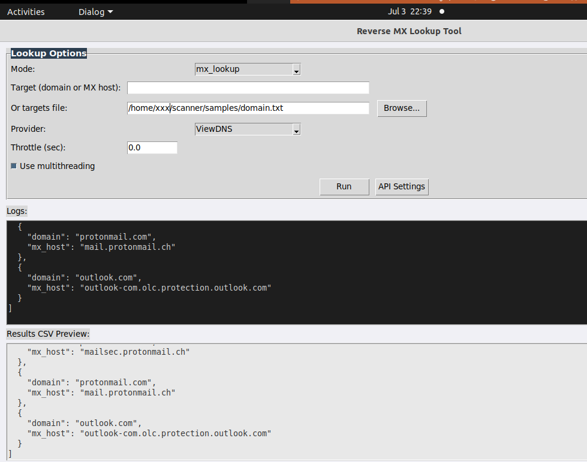

# Internet Scanners OSINT Tool

Author: m00gly  
License: MIT  
Repository: [https://github.com/mo0ogly/Internet-Scanners-OSINT-Tool](https://github.com/mo0ogly/Internet-Scanners-OSINT-Tool)

---

## Overview

The **Internet Scanners OSINT Tool** is a Python-based solution for extracting and enriching IP addresses used by internet scanning projects.

It leverages data published in the repository:

> [MDMCK10/internet-scanners](https://github.com/MDMCK10/internet-scanners)

This tool is intended for:
- Cybersecurity analysts
- Threat hunters
- Network defenders
- Researchers analyzing scanner infrastructures

The tool is available as:
- A **Command-Line Interface (CLI)**
- A **Tkinter-based Graphical User Interface (GUI)**

Both share the same enrichment logic and support:
- cloning or updating the GitHub data repository
- extracting IPs from text-based formats
- performing enrichment:
  - PTR lookups
  - ASN and network data via IPWhois
  - (optional) AbuseIPDB reputation data
- exporting results to JSON and CSV
- displaying logs (console, file, or GUI)

---

## Features

- Detects both IPv4 and IPv6 addresses
- Reverse DNS lookups (PTR)
- ASN and network enrichment
- Optional **AbuseIPDB** integration:
  - abuse confidence score
  - ISP
  - country
  - last reported timestamp
- Throttling control for API rate limits
- Timestamped JSON and CSV outputs
- Configurable file paths and names
- Verbose logging
- Multithreading support

---

## Prerequisites

- Python 3.8+
- Git installed

Install required Python packages:

```

pip install requests ipwhois

```

---

## Installation

Clone the repository:

```

git clone [https://github.com/mo0ogly/Internet-Scanners-OSINT-Tool.git](https://github.com/mo0ogly/Internet-Scanners-OSINT-Tool.git)
cd Internet-Scanners-OSINT-Tool

```

The tool will automatically clone or update the upstream data repository:

> [MDMCK10/internet-scanners](https://github.com/MDMCK10/internet-scanners)
 


## Python installation

To install all required Python dependencies, run:

```

pip install -r requirements.txt

```

This tool depends on the following main Python packages:

- `requests` → for HTTP requests to services like AbuseIPDB
- `ipwhois` → for ASN and network enrichment

These are specified in `requirements.txt`:


```

requests>=2.25.1
ipwhois>=1.2.0

```


### Tkinter (GUI Usage) Installation and Verification (Linux)

The graphical user interface (GUI) uses **Tkinter** for Python.

On many Linux distributions, Tkinter is not installed by default, especially on minimal or server installations.

To install it on Ubuntu:

```

sudo apt update
sudo apt install python3-tk

```

To verify if Tkinter is installed correctly:

```

python3 -c "import tkinter; print(tkinter.TkVersion)"

```

If installed, you should see a version number such as:

```

8.6

```

If you receive an error like:

```

ModuleNotFoundError: No module named 'tkinter'

```

→ It means Tkinter is missing and needs to be installed.

If you are working on a headless server without a graphical environment, you can still use the CLI version of this tool without Tkinter.

 

---

## CLI Usage

Run the CLI script:

```

python3 internet\_scanner\_cli.py

```

### CLI Options

| Option | Description |
|--------|-------------|
| `--repo-url` | URL of the git repo to clone (default MDMCK10 repo) |
| `--repo-path` | Local path for repo clone |
| `--output-json` | JSON filename for results |
| `--output-csv` | CSV filename for results |
| `--abuseipdb-api-key` | Your AbuseIPDB API key |
| `--enable-abuseipdb` | Enable AbuseIPDB lookups |
| `--throttle` | Delay in seconds between AbuseIPDB requests |
| `--no-multithread` | Disable multithreading |

#### Example

Enable AbuseIPDB lookups with throttling:

```

python3 internet\_scanner\_cli.py --enable-abuseipdb --abuseipdb-api-key YOUR\_KEY --throttle 1.0

```

---

## GUI Usage

Run the GUI:

```

python3 gui\_scanner.py

```

### GUI Features

- Browse to select logs and results directories
- Configure output filenames for JSON and CSV
- Enable/disable multithreading
- Enable/disable AbuseIPDB lookups
- Enter and save the AbuseIPDB API key
- Configure throttle delay between requests
- Live logs in a scrollable window
- Display summary statistics after extraction

### Screenshot

 


---

## Architecture Diagram

```

```
      +--------------------------------------------+
      |     MDMCK10/internet-scanners Repository   |
      +----------------------+---------------------+
                             |
              
                             |
                             v1
```

+-------------------------------------------------------------+

| InternetScannerExtractor Class                                  |
| --------------------------------------------------------------- |
| - Scans text files (.txt, .conf, .nft, etc.)                    |
| - Extracts IPv4/IPv6 IPs                                        |
| - Enriches data:                                                |
| - PTR lookups                                                   |
| - ASN info via IPWhois                                          |
| - \[optional] AbuseIPDB API lookups                             |
| - Exports JSON and CSV with timestamp                           |
| +-------------------------------------------------------------+ |

```
                             |
        +--------------------+--------------------+
        |                                         |
        v                                         v
CLI output to console                     GUI live logs
+ writes scanner.log                      + interactive controls
                                          + statistics panel
```

````

---

## Usage Scenarios

This tool helps in:

- Tracking scanning infrastructure and known scanner IPs
- Correlating scanner IPs with ASN owners or ISPs
- Checking scanners' reputation via AbuseIPDB
- Feeding enriched data into SIEMs, blocklists, or threat intelligence platforms
- Investigating suspicious traffic or logs in network forensics

---

## Typical Results

### JSON Output Example

```json
[
  {
    "owner": "internetresearchproject_v4",
    "ip_or_cidr": "45.33.84.152",
    "ptr_record": "scanner.example.net",
    "asn": "AS63949",
    "asn_description": "Linode, LLC",
    "country": "US",
    "network_name": "LINODE-US",
    "network_cidr": "45.33.64.0/18",
    "abuseConfidenceScore": 0,
    "totalReports": 0,
    "countryCodeAbuseIPDB": "US",
    "domainAbuseIPDB": null,
    "ispAbuseIPDB": "Linode, LLC",
    "lastReportedAt": null
  }
]
````

### CSV Output Example

| owner                       | ip\_or\_cidr | ptr\_record         | asn     | asn\_description | country | network\_name | network\_cidr | abuseConfidenceScore | totalReports | countryCodeAbuseIPDB | domainAbuseIPDB | ispAbuseIPDB | lastReportedAt |
| --------------------------- | ------------ | ------------------- | ------- | ---------------- | ------- | ------------- | ------------- | -------------------- | ------------ | -------------------- | --------------- | ------------ | -------------- |
| internetresearchproject\_v4 | 45.33.84.152 | scanner.example.net | AS63949 | Linode, LLC      | US      | LINODE-US     | 45.33.64.0/18 | 0                    | 0            | US                   | null            | Linode, LLC  | null           |

---

## Practical Tips

* AbuseIPDB lookups are **disabled by default**. Enable only if you have sufficient API quota.
* Increase the throttle value to avoid HTTP 429 (Too Many Requests) errors.
* Use JSON for SIEM ingestion (Elastic, Splunk, etc.).
* Use CSV for quick review in Excel or other analysis tools.
* All logs are saved to `scanner.log` and also displayed in the GUI if using the graphical mode.

---

## AbuseIPDB API Limits

* Free plans → 1,000 requests/day
* Webmaster plans → 3,000 requests/day
* Repeated reporting of the same IP is limited to once every 15 minutes

If you exceed the limits, you may receive HTTP 429 errors.

---

## How to Extend

* Add new enrichment providers (e.g. Shodan, VirusTotal) in:

  ```
  InternetScannerExtractor.enrich_ip()
  ```
* Support new file formats in:

  ```
  parse_files()
  ```
* Integrate new stats in:

  ```
  summarize_stats()
  ```
* Change to other repositories by adjusting:

  ```
  repo_url and repo_path
  ```

---

## License

This project is licensed under the MIT License.

---

## Credits

* Data Source: [MDMCK10/internet-scanners](https://github.com/MDMCK10/internet-scanners)
* AbuseIPDB API for reputation data

Developed and maintained by **m00gly**.
======================================================================
 
# Reverse MX Lookup Tool

An advanced OSINT tool to analyze email infrastructure by performing:

* **MX lookups**: find which mail servers handle a domain’s email
* **Reverse MX lookups**: discover domains hosted on the same mail server

Supports:

* CLI mode (batch-friendly, scriptable)
* GUI mode (Tkinter)
* Multithreading for faster lookups
* CSV and JSON exports
* Optional integration with external APIs (ViewDNS, DomainTools, WhoisXML)

---

## Features

MX Lookup for any domain
Reverse MX Lookup via:

* [ViewDNS.info](https://viewdns.info/reversemx/) (API key support)
* DomainTools (simulated for testing)
* WhoisXML (simulated for testing)

Single target or batch file input
CLI and GUI with live logs
Configurable throttle between requests
CSV export of results
Thread-safe, multi-threaded processing
Config file to store API keys


### Screenshot

 



---

## Installation

**Requirements:**

* Python ≥ 3.8
* pip

Install dependencies:

```bash
pip install -r requirements.txt
```

**Dependencies include:**

* `requests`
* `dnspython`
* `tkinter` (usually installed by default with Python)

Check your installed Tkinter version:

```bash
python3 -c "import tkinter; print(tkinter.TkVersion)"
```

---

## Usage (CLI)

**MX Lookup single domain:**

```bash
python3 cli_Reverse_MX_Lookup_Tool.py \
    --mode mx_lookup \
    --target example.com
```

**Reverse MX Lookup single host:**

```bash
python3 cli_Reverse_MX_Lookup_Tool.py \
    --mode reverse_mx \
    --target mx1.example.com \
    --provider ViewDNS
```

**Reverse MX with multiple targets from file:**

```bash
python3 cli_Reverse_MX_Lookup_Tool.py \
    --mode reverse_mx \
    --targets-file mx.txt \
    --provider ViewDNS \
    --export-csv output.csv \
    --throttle 1.0
```

**Example `mx.txt`:**

```
aspmx.l.google.com
mail.protonmail.ch
mx1.mail.ovh.net
```

---

## Usage (GUI)

Run the graphical interface:

```bash
python3 gui_Reverse_MX_Lookup_Tool.py
```

**Features in GUI:**

* Mode selection (mx\_lookup or reverse\_mx)
* Single domain/host or load targets from file
* Provider selection (for reverse MX)
* Throttle control
* Multithreading toggle
* Live logs window
* CSV result preview
* Button to save results

---

## Config & API Keys

External APIs may require keys (e.g. ViewDNS).
Store keys in a JSON file:

```
config/settings.json
```

Example:

```json
{
    "viewdns_api_key": "YOUR_API_KEY",
    "domaintools_api_key": "YOUR_API_KEY",
    "whoisxml_api_key": "YOUR_API_KEY"
}
```

---

## Example Output

```json
[
  {
    "domain": "example.com",
    "mx_host": "aspmx.l.google.com"
  }
]
```

or CSV:

```
domain,mx_host
example.com,aspmx.l.google.com
```

---

## Architecture

* **cli\_Reverse\_MX\_Lookup\_Tool.py** → CLI entry point
* **gui\_Reverse\_MX\_Lookup\_Tool.py** → GUI with Tkinter
* **ReverseMXLookup class** → core logic for lookups
* Logs stored under `logs/reverse_mx_tool.log`

---

## Roadmap

* Integrate real DomainTools and WhoisXML APIs
* Better error handling in ViewDNS integration
* Enhance GUI with progress bars

---

## License

MIT

---
Developed and maintained by **m00gly**.

